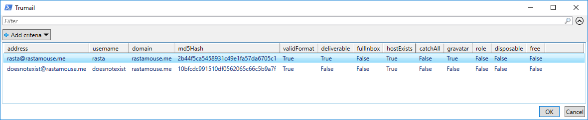

# Invoke-Trumail

## Intro

> Trumail is a robust and powerful email address verification API written on top of some of the must cutting edge technologies. It was built with the intention of providing developers and businesses with a simple and easy to use solution to bounced emails.

```json
{
    "address": "user@domain.com",
    "username": "user",
    "domain": "domain.com",
    "validFormat": true,
    "deliverable": true,
    "fullInbox": false,
    "hostExists": true,
    "catchAll": true,
    "disposable": false,
    "free": false
}
```

## Usage

```
PS C:\> gc .\emails.txt
rasta@rastamouse.me
doesnotexist@rastamouse.me

PS C:\> ipmo .\Invoke-Trumail.ps1
PS C:\> Invoke-Trumail -EmailFile .\emails.txt
```

